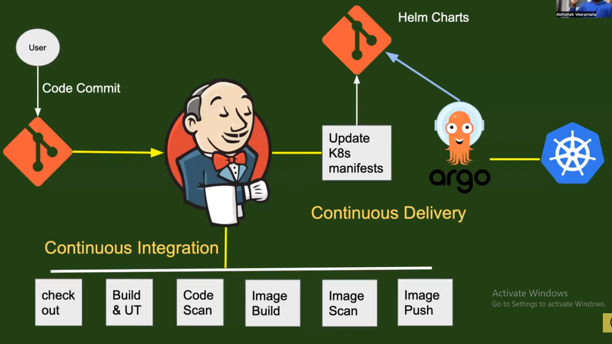

## CICD Process

**Source Code Management (SCM):**
- The pipeline starts with a code repository, such as GitHub, GitLab, or Bitbucket.
- Changes to the code trigger the pipeline. (Enable triggers for pipeline execution on push, pull requests, or commits).

**Choose a CI/CD Tool:**
- Examples: Jenkins, GitLab CI/CD, CircleCI, GitHub Actions, Travis CI.
- Configure the tool to connect with your VCS.

**Build:**
- The code is compiled or built. (Write build scripts (e.g., using Dockerfile, Makefile, or custom scripts)).
- Dependencies are installed, and artifacts (like .jar, .war, or Docker images) are created.

**Testing:**
- Automated tests (unit, integration, and functional tests) are executed. Define testing stages such as unit tests, integration tests, and end-to-end (E2E) tests. It ensure code quality and catch bugs early.
- Code quality checks (using tools like SonarQube) may also be included.

**Staging:**
- Configure deployment environments (development, staging, production).
- A replica of the production environment is used for additional testing.
- Ensures the code behaves as expected in an environment similar to production.

**Deployment:**
- Code is deployed to production automatically or manually after approval.
- Use tools like Docker and Kubernetes for containerized applications.
- Leverage Ansible or Terraform for Infrastructure as Code (IaC) setups.

**Automate Rollbacks:**
- Implement mechanisms to roll back changes if something goes wrong.
- Use blue-green deployment or canary release strategies for safer rollouts.

**Monitoring, Feedback & Optimization:**
- Once deployed, the application is monitored using tools like Prometheus, Grafana, or New Relic.
- Feedback from monitoring helps in fixing issues or optimizing the pipeline.
- Analyze logs to improve the pipeline.

_____________________________________________________________________________________________

## Example Pipeline Implementation:

Use the following tools orchestrated with Jenkins to achieve CICD.
- Maven, Sonar, AppScan, ArgoCD, and Kubernetes

1. Code Commit: Developers commit code changes to a Git repository hosted on GitHub.
2. Jenkins Build: Jenkins is triggered to build the code using Maven. Maven builds the code and runs unit tests.
3. Code Analysis: Sonar is used to perform static code analysis to identify any code quality issues, security vulnerabilities, and bugs.
4. Security Scan: AppScan is used to perform a security scan on the application to identify any security vulnerabilities.
5. Deploy to Dev Environment: If the build and scans pass, Jenkins deploys the code to a development environment managed by Kubernetes.
6. Continuous Deployment: ArgoCD is used to manage continuous deployment. ArgoCD watches the Git repository and automatically deploys new changes to the development environment as soon as they are committed.
7. Promote to Production: When the code is ready for production, it is manually promoted using ArgoCD to the production environment.
8. Monitoring: The application is monitored for performance and availability using Kubernetes tools and other monitoring tools.

_____________________________________________________________________________________________

## CI/CD Workflow from Dev to Stage to Prod Environments:

**Dev Stage:** Code push triggers Jenkins CI Pipeline.
- Steps: Build → Test → Artifact Creation (e.g., Docker image).

**Staging Stage:** Jenkins deploys to a Kubernetes staging cluster.
- Steps: Deploy → Run Tests → Approval Gate.

**Production Stage:** Deploys approved artifact to production.

_____________________________________________________________________________________________

**Step 1: Code Development in Dev Environment:**
- Developers write code in their local environments. 
- Code is version-controlled using tools like Git (GitHub, GitLab, Bitbucket).

**Step 2: Continuous Integration:**
- Code is pushed to the repository. CI server triggers a pipeline that performs Code Compilation, Static Code Analysis, Unit Testing.
- Build the code → Run tests → Generate reports.
- If successful, create an artifact (e.g., Docker image).
- Tools: Jenkins, GitHub Actions, GitLab CI/CD, CircleCI.

**Step 3: Deployment to Staging (Stage):**
- Build Artifacts from the CI stage are deployed to a staging environment.
- Tests performed include Integration Tests, UI/UX Tests, Smoke Tests.
- Manual approval (optional) before proceeding to production.
- Tools: Kubernetes, Docker, Helm, Terraform, Ansible.

**Step 4: Deployment to Production (Prod):**
- Once staging tests pass, the artifact is promoted to production.
- Deploy using blue-green or canary deployment strategies to minimize downtime and risk.
- Monitor application performance using tools like Prometheus, Grafana, or ELK Stack.

_____________________________________________________________________________________________

## CICD Use-case:

The pipeline starts with a code commit, then progresses through CI stages (checkout, build, test, scanning, and image building). The image is pushed to a registry, YAML manifests are updated, and finally, the application is deployed to Kubernetes using Argo CD or scripts."

- Git Repository → Code Commit.
- Jenkins (CI stages: checkout, build, test, scan, image build, push).
- Image Registry (e.g., Docker Hub).
- GitOps Tool (e.g., Argo CD) or scripts.
- Kubernetes Cluster.

#### 1. Start with Version Control:
- Begin by mentioning the Version Control System you use. Example: GitHub, GitLab, or Bitbucket.- Specify the Target Platform. Example: Kubernetes (a popular choice for container orchestration).
- For instance, say: "We use GitHub as our source code repository, and our target deployment platform is Kubernetes. The pipeline automates every stage from code commit to deployment."

#### 2. Code Commit and Webhook Trigger:
- Explain the workflow upon code commit:
- A developer commits code to the repository (e.g., GitHub).
- A webhook triggers the pipeline in the CI/CD orchestrator (e.g., Jenkins).
- Say: "When a user commits code to the GitHub repository, a Git webhook triggers the Jenkins pipeline to initiate the CI/CD process."

#### 3. Continuous Integration (CI):
CI involves multiple stages. Here’s how you can describe each:

**(a) Checkout Stage:**
- Pull the code from the repository.
- Example: "The first stage in the pipeline is the checkout stage, where we pull the latest code commit from the GitHub repository."

**(b) Build and Unit Testing Stage:**
- Build the application using tools like Maven (Java), npm (Node.js), or pip (Python).
- Run unit tests to ensure code correctness.
- Optional: Perform static code analysis for linting and formatting.
- Example: "In the second stage, we build the application using Maven for our Java project. We also run unit tests with frameworks like JUnit to validate functionality. Additionally, static code analysis is performed using tools like Checkstyle or PMD to ensure code quality."

**(c) Code Scanning Stage:**
- Scan for vulnerabilities using tools like SonarQube.
- Example: "Next, we perform code scanning with SonarQube to identify security vulnerabilities and maintain code quality."

**(d) Image Building Stage:**
- Build a container image using tools like Docker or Buildah.
- Use the Dockerfile stored in the repository.
- Example: "After code scanning, we build a container image using Docker. This image packages the application with all dependencies and is ready for deployment to Kubernetes".

**(e) Image Scanning Stage:**
- Verify the container image for vulnerabilities using tools like Trivy or Clair.
- Example: "In the image scanning stage, we validate the container image to ensure it is free from vulnerabilities in base images or dependencies."

**(f) Push to Image Registry:**
- Push the container image to a registry like Docker Hub, AWS ECR, or Quay.io.
- Example: "Finally, the container image is pushed to our image registry, AWS ECR, where it is stored for deployment."

#### 4. Continuous Delivery (CD):
After CI, the pipeline progresses to deployment:

**(a) Update Kubernetes Manifests:**
- Update YAML files with the new container image version.
- Store the manifests in a Git repository (can be the same or separate from the source code repository).
- Example: "The next stage involves updating Kubernetes YAML manifests or Helm charts with the new image version. These manifests are stored in a separate Git repository to maintain clear separation from the source code."

**(b) Use GitOps for Deployment:**
- Use tools like Argo CD or FluxCD to deploy changes automatically:
- Argo CD watches the Git repository for updates and syncs them to the Kubernetes cluster.
- Example: "We use Argo CD as our GitOps tool. It continuously monitors the Git repository for updated manifests and applies them to the Kubernetes cluster. This ensures that Git remains the single source of truth."
- Alternative to GitOps: "If GitOps is not used, we deploy manifests using Ansible or shell scripts. These scripts execute kubectl or Helm commands to apply the updates to the Kubernetes cluster."

#### 5. Advantages of Declarative Pipelines:
- We write our Jenkins pipelines using the declarative approach, as it simplifies collaboration and is more structured than scripted pipelines.

_____________________________________________________________________________________________

## CI/CD Workflow for Promoting Code from Feature Branch to Production

**Feature Branch Development:**
- Developers create feature branches for each individual feature or enhancement they are working on.
- Each feature branch is independent, focusing on specific changes (e.g., new UI pages, database enhancements).
- Once the feature development is done, a Jenkins pipeline is triggered to deploy the feature to the developer Kubernetes environment (or development environment).
- This ensures that the code is deployed and tested in an isolated environment dedicated to that specific feature.

**Main/Master Branch Integration:**
- Once the feature is ready and verified in the development environment, the changes are merged into the main branch (or master).
- A Jenkins pipeline is triggered for the main branch, which triggers stages such as building, unit testing, and code quality analysis.
- The code is then deployed to the staging environment (which could be a different Kubernetes cluster or a namespace in the same cluster).

**Staging Environment:**
- The staging environment is used to test the integrated changes with other features that have been merged into the main branch.
- The QA team (or automated tests) performs various tests, including functional testing, regression tests, performance testing, and security/penetration testing.
- This ensures the quality and stability of the application before it moves to production.

**Release Branch:**
- Once the QA team signs off on the staging environment, the changes are ready to be released.
- A release branch is created from the main branch. This marks the code that will be deployed to production.
- Another Jenkins pipeline is triggered from this release branch, and after running necessary tests (unit, regression, and security tests), the code is deployed to the pre-production (or UserAcceptanceTesting) environment.

**Pre-production/UAT Environment:**
- The pre-production environment (or UAT) is where final acceptance tests are done before going live.
- The QA team performs additional validation to ensure everything is functioning as expected in a production-like environment.

**Production Deployment:**
- After the release candidate passes the pre-production testing, the changes are deployed to the production environment.
- In the production pipeline, extra caution is taken, such as running additional tests like pen-testing, and ensuring the system’s performance under load.
- The code is deployed to the production Kubernetes cluster, and after the final checks, it goes live for end-users.

_______________________________________________________________________________________________

